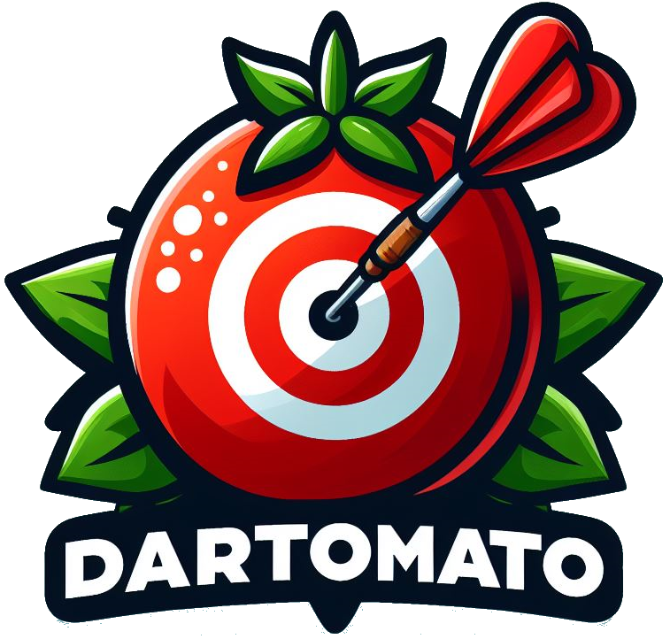
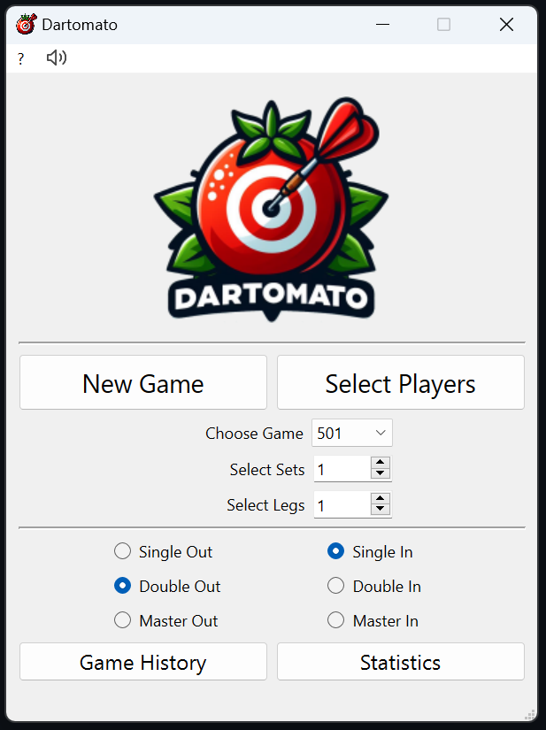
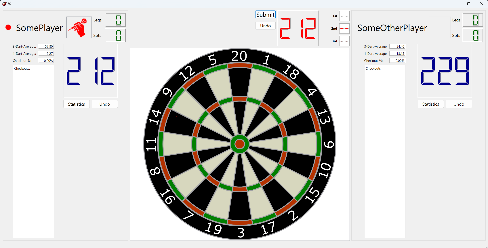
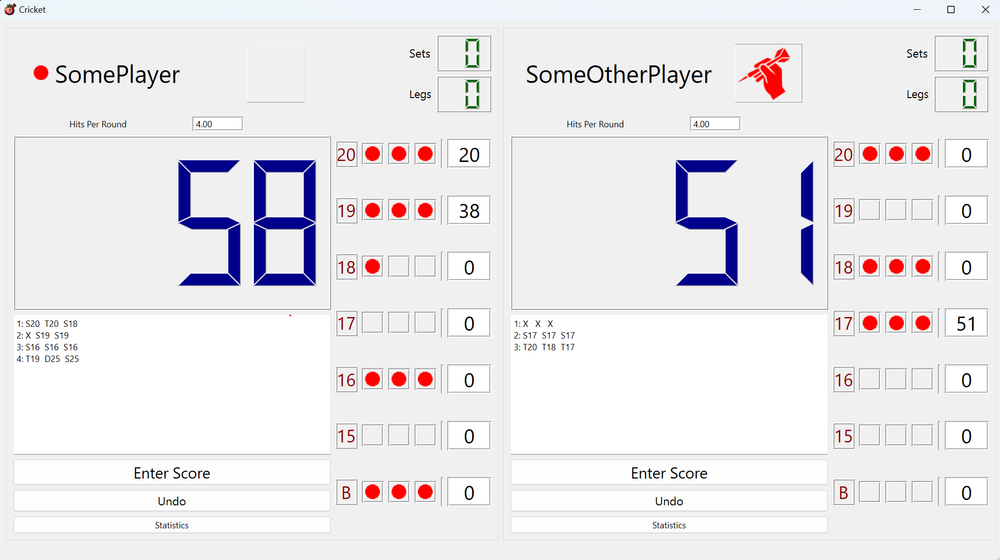

Dartomato is a small desktop Darts Scoring App running on Windows and Ubuntu.

## Usage
Download the latest Release for Windows or Ubuntu and run the **Dartomato** executable from the bin/ sub-directory: [Release Page](https://github.com/m1ld3/dartomato/releases/).

### Supported Games
The game supports X01 (301, 501, 701) and Cricket - for up to eight players. 

### Selecting Players
Click on **Select Players** on the Start Menu and create and select at least one player. Existing players are shown in the list. 

You can also delete existing players. This will delete the player from the list and also all game data related to this player. **CAUTION!!** This action cannot be undone!

### Starting a Game
Select at least one player. Select the Game and the desired number of Sets and Legs (Best of Mode). Select the Game Mode (**Double Out**, **Single In**, etc...). Hit the **New Game** button starts the game.

### Playing X01
Click on the Dartboard to enter each Dart individually. In case of 0 (No Score), click on the ring of the board. Hit the **Submit** button afterwards.

### Playing Cricket
Click on **Enter Score** to open the Dartboard. Enter your score on the Dartboard like before. Clicking on **Submit** will close the Dartboard again.

### Undo
There are two kinds of **Undo** buttons.
1. Pre-Submit Undo: This **Undo** button deletes a single Dart which has been entered by clicking on the Dartboard.
2. Post-Submit Undo: This **Undo** reverts a complete score which has been already submitted by a player.

### In-Game Statistics
Clicking the **Statistics** button during an active game will open the in-game statistics window for a particular player.

### Global Statistics
For global all-time statistics click the **Statistics** button on the Start Menu. Use the drop down menus for selecting players and the game for which you want to see data.
You can select more than one player for better comparison!

### Game History
There is **Game History** button on the Start Menu which lists all saved games. You can resume unfinished games, restart finished games with the same configuration, and you can look at the statistics of each game. 

It is also possible to delete games. **CAUTION!!** Deleting a game cannot be undone!

### Miscellaneous
The red dot next to the player's name means that he or she started the leg.
The rectangle next to the player's name is either empty or shows the red "dart throwing hand" icon. The icon shows which player's turn it is.
You can change the player order by clicking on this icon rectangle.

